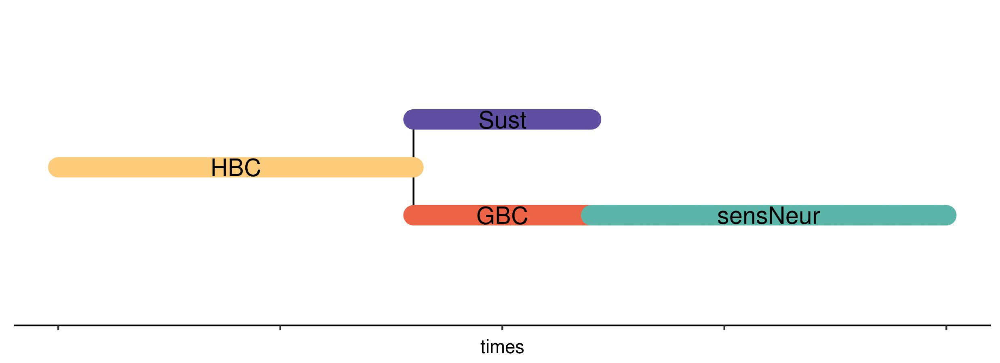
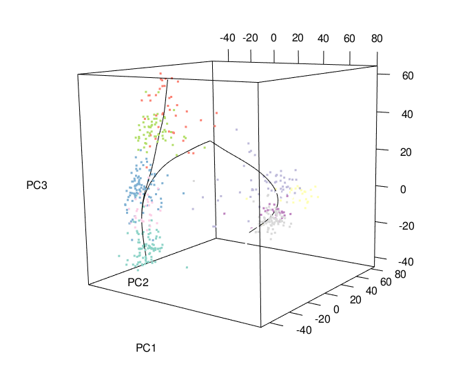

```{r setup, include = F}
knitr::opts_chunk$set(cache=TRUE, message = F, warning = F, fig.height = 6, fig.width = 10, fig.align = "center", autodep=TRUE, out.width="600px", out.height="600px", results="markup")
library(ggplot2)
theme_update(plot.title = element_text(hjust = 0.5))
set.seed(48132) # for reproductivity
```

# 1 - Introduction

This vignette describes the workflow for the R package `warpDE`, illustrating three different methods to infer differentially expressed (DE) genes from reconstructed cell lineages. After a first step of lineage inference and cell pseudotime ordering performed with the R package `slingshot` [@Street2017], the goal is to identify genes that are DE between two cell lineages.

This vignette uses data from [@Fletcher2017], examining the differentiation of horizontal basel cells (HBC) into neuronal and sustentatucal cells in the mouse olfactory epithelium (OE). For the sake of simplicity, we restricted the data to only two cell lineages.

<!--  -->


<center>Cell lineages used in the study</center>

## 1.1 - Preprocessing

Before searching for differentially expressed genes between lineages, we have to preprocess the data and run `slingshot` on it. We use data from [@Fletcher2017] [*** SD: Say where the data can be obtained.], that were already filtered and normalized with [`scone`](https://github.com/YosefLab/scone). The R package `scone` implements a variety of normalization procedures, aiming to adjust for technical effects such as batch effects and sequencing depth, and provides performance measures for selecting an appropriate normalization. 

The pre-processed OE data are available in the package [`warpDE`](https://github.com/strayMat/warpDE), which contains also the different functions that we use in this study. We also load the package [`slingshot`](https://github.com/kstreet13/slingshot) [@Street2017] which allows us to perform lineage inferrence.

```{r, message = F}
library(warpDE)
library(slingshot)
library(gridExtra)
# For nice colors
library(RColorBrewer)
data("OE_counts")
```

We perform a usual transformation with `log(1+x)` and we run principal component analysis (PCA) as the dimensionality reduction technique:
```{r}
pca <- prcomp(t(log1p(counts)))
# nice colors for the clusters
clust_col = brewer.pal(length(unique(clusters)),"Set3")[as.numeric(clusters)] 
plot3d(pca$x[,1:3], col = clust_col, size = 5)
```

We apply `slingshot` to infer the lineages and pseudotimes: 
```{r}
slrun <- slingshot(pca$x[,1:3], clusters, start.clus = '1', end.clus = '4')
```

`slingshot` draws smooth curves in the 3D representation of the cells.

```{r}
open3d()
plot3d(pca$x[,1:3], col = clust_col, size = 5)
plot3d.SlingshotDataSet(slrun, type = "curves", add = T, size = 0.5)
rglwidget()
```

<!--  -->
<!-- <center>View of the first 3 PCs of the cells with the Slingshot lineages</center> -->

We can also have a 2D plot of the lineages by projecting on the first two PCs:

```{r,fig.height=5, fig.width=5, fig.align="center"}
# generate 2D captures of the 3d plots for the rmarkdown
par(cex.main = 1)
plot(pca$x[,1:2], col = clust_col, pch=16, asp = 1)
for(c in curves(slrun)){ 
  lines(c$s[c$tag,c(1,2)], lwd = 1)
}
title("View of the first two Pcs of the data with principal curves")
```

Then, we store the `slingshot` output in a new data object of class `warpDEDataSet` with the desired input for our future DE analysis: 
```{r}
times <- pseudotime(slrun)
weights <- curveWeights(slrun)
# Normalization of the weights (we want convex weights)
w1 <- weights[,1]/(weights[,1] + weights[,2])
w2 <- weights[,2]/(weights[,1] + weights[,2])
w <- cbind(w1,w2)
df <- new("warpDEDataSet", counts = counts, t = times, w = w)
```

The other dataset in the package `warpDEDataSet_example` contains exactly this `df` object, so you are not forced to re-do the whole `slinghshot` workflow.

# 2 - Visualization

We plot the gene expression profile for the first gene of the dataset: CreER.
The points are colored by lineage: red is the first lineage (GBC and neuronal cells) and blue is the second lineage (sustentacular cells).
```{r,fig.height=4, fig.width=6, fig.align="center"}
gene <- "CreER"
reg_gam(df, gene, regression = F)
```
We fit a separate `ns` (natural spline) regression for each lineage as the alternative model and one `ns` regression including both lineages at the same time (the null model). This gives us a representation of the activation pattern for a given gene.
```{r,fig.height=4, fig.width=6, fig.align="center"}
reg_gam(df, gene, legend.show = T, reg.f = "ns")$pl
```

The main goal of the analysis is to find genes which are differrentially expressed between the two reconstructed lineages. In a sense we are searching for branching expression pattern, branching curves in our visualization.
```{r}
grid.arrange(reg_gam(df, 'Cyp2g1')$pl, reg_gam(df, "Myo9a")$pl, ncol = 2)
```

On the left,  we displayed Cyp2g1, a differentially expressed gene with a pattern similar to the ones that we want to detect.
On the right, we see an unintersting pattern for us; both genes are expressed similarly in both lineages.

# 3 - Differential expression methods

## 3.1 - Likelihood-based method

```{r, include = F, echo = F}
# load ranking instead of computing them in order to gain time for knit (from 30 min to 2 min)
# load("/home/matthieu/Documents/Berkeley/work_Berkeley/warpDE/tests/f.rankings/s.lkl.ranks.RData")
# load("/home/matthieu/Documents/Berkeley/work_Berkeley/warpDE/tests/f.rankings/s.dtw.ranks.RData")
# load("/home/matthieu/Documents/Berkeley/work_Berkeley/warpDE/tests/f.rankings/s.mix.ranks.RData")
```

The comparision between the alternative model and the null model can be computed via likelihood ratio test or with AIC. The function `likelihood_rank` computes these values and returns a ranking. This ranking function takes a few minutes to run. 

The main tuning parameters are: 

- **the choice of regression function:** `reg.f` is either 'loess' (from  [@Cleveland1988]) or 'ns' for natural cubic splines;

- **the smoothing parameter:** `s.df`, the equivalent degrees of freedoms for natural splines and `span`, the span parameter for the loess.
```{r}
s.rank <- likelihood_rank(df, 'ns', pval = T, s.df = 4)
s.aic.rank <- s.rank$aic
s.pval.rank <- s.rank$pval
```

You can then  plot the first genes picked by the method by running `plot_genes`
```{r}
plot_genes(df, s.aic.rank)
plot_genes(df, s.pval.rank, order = "head", nb.show = 10, grid.size = c(2,5))
```

Here is also an exemple of the worst genes picked by this method : 
```{r}
plot_genes(df, s.pval.rank, order = "tail")
```

## 3.2 - Dynamic time warping method

Another way to infer differentially expressed genes is to consider the gene counts as time series data. Thus, for each gene we simply compare the difference between each lineages with the Dynamic Time Warping distance which allows local distorsions of the time axis. We can also choose the regression and the smoothing parameter, even though the ranking of the genes seems to be less dependent of the tuning parameters for this method. Another important tuning parameter is the window size of the warping, which changes how locally the distorsion is performed.

```{r}
s.dtw.rank <- dtw_rank(df, reg.f = "ns" , s.df = 4)
```

```{r}
plot_genes(df, s.dtw.rank)
```

## 3.3 - Hybrid method

We also tried to combine both methods. First, we align the cells of both lineages on a common time scale with DTW. Then we compute their similarity thanks to the likelihood method. As in the other methods the tuning parameters are the choice of the regression and the smoothing parameter, as well as the DTW parameters (see [@Giorgino2009] for more details on DTW options).

We can see the warped pattern by calling `dtw_align` with `align.show = true`
```{r}
gene <- "Prpf8"
grid.arrange(reg_gam(df, gene, reg.f = "ns", s.df = 4)$pl, dtw_align(df, gene, reg.f = "ns", s.df =4, align.show = T)$pl, ncol = 2)
```

Computation of the combined method :
```{r}
s.mix.rank <- likelihood_rank(df, reg.f = "ns", s.df = 4, dtw = T)$aic
```

```{r, fig.align = 'center', fig.width = 10}
plot_genes(df, s.mix.rank)
```

# 4 - Comparison of different gene rankings

## 4.1 - One-versus-one comparison 

You can compare two rankings with the `rankings_compare` function which wrapps three different comparisons:

- A scatter plot of both lineages;

- A comparison of the shared elements in the differents quantiles of the two rankings

- A measure of the [Kendall's tau](https://en.wikipedia.org/wiki/Kendall_rank_correlation_coefficient) between the two rankings (a measure of the number of concordant and discordant permutations of ranks). 
```{r, fig.width= 7}
dtw.aic <- rankings_compare(s.dtw.rank, s.mix.rank)
dtw.aic$pl
dtw.aic$shared.q
dtw.aic$kendalls.tau
```

## 4.2 - Multiple comparisons

We provided `kendall.heatmap` a quick visualization tool for multiple rank comparisons:
```{r, fig.width = 6, fig.height = 6}
kendall.heatmap(list(s.aic.rank, s.mix.rank, s.dtw.rank))
```

## 4.3 - Exploring one particular ranking

We also created an visualization of the distribution of the distances used for ranking genes. We plot this as an Elbow curve, which points at a hard threshold for differentially expressed genes based on this distribution.
```{r, fig.width= 6}
elbow_curve(s.mix.rank)$pl
```

# References
